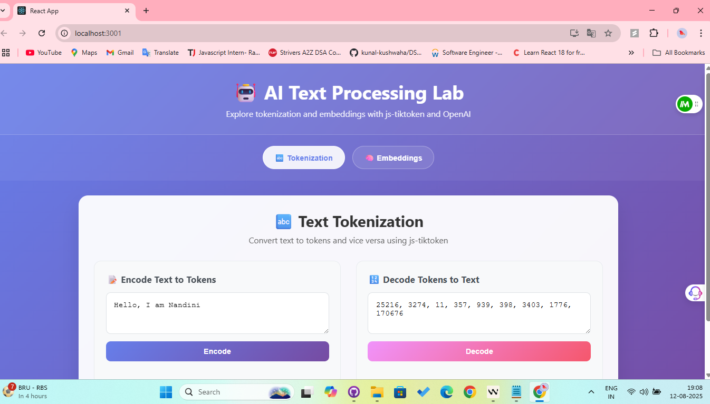

# 🤖 AI Text Processing Lab

A modern React.js application that demonstrates text tokenization using js-tiktoken and vector embeddings generation using OpenAI's API. This interactive web application provides a hands-on way to explore how text is processed in AI systems.


## 📸 Screenshots

### 🔤 Tokenization Interface

*The tokenization tab showing text-to-tokens encoding and tokens-to-text decoding with real-time token counting*

### 🧠 Embeddings Interface  

*The embeddings tab displaying vector generation, statistics, and interactive visualization*

### 🎨 Modern UI Features
- **Glassmorphism design** with gradient backgrounds and blur effects
- **Interactive token display** with individual token highlighting
- **Real-time statistics** and embedding visualization
- **Responsive layout** that adapts to different screen sizes

## ✨ Features

### 🔤 Text Tokenization
- **Encode text to tokens** using js-tiktoken with the o200k_base model
- **Decode tokens back to text** with comprehensive error handling
- **Real-time token counting** and visualization
- **Copy-to-clipboard** functionality for easy sharing
- **Interactive token display** with individual token highlighting

### 🧠 OpenAI Embeddings
- **Generate vector embeddings** using OpenAI's text-embedding-3-large model
- **Embedding statistics** including dimensions (3072), model info, and input length
- **Vector visualization** showing the first 50 dimensions as colored bars
- **Embedding preview** with formatted numerical values
- **Full vector export** with copy-to-clipboard functionality
- **Loading states** and comprehensive error handling

### 🎨 Modern UI/UX
- **Glassmorphism design** with gradient backgrounds and blur effects
- **Responsive layout** that works seamlessly on desktop and mobile
- **Smooth animations** and hover effects throughout
- **Tab-based navigation** for easy switching between features
- **Interactive visualizations** with tooltips and hover states
- **Professional color scheme** with intuitive visual feedback

## 🚀 Quick Start

### Prerequisites
- Node.js (v14 or higher)
- npm or yarn
- OpenAI API key

### Installation

1. **Clone the repository**
   ```bash
   git clone <repository-url>
   cd tokenization-app
   ```

2. **Install dependencies**
   ```bash
   npm install
   ```

3. **Set up environment variables**
   Create a `.env` file in the root directory:
   ```env
   REACT_APP_OPENAI_API_KEY=your_openai_api_key_here
   ```

4. **Start the development server**
   ```bash
   npm start
   ```

5. **Open your browser**
   Navigate to [http://localhost:3000](http://localhost:3000)

## 🛠️ Technology Stack

- **Frontend**: React.js with functional components and hooks
- **Tokenization**: js-tiktoken/lite with o200k_base model
- **AI Integration**: OpenAI API for embeddings generation
- **Styling**: Modern CSS with gradients, animations, and responsive design
- **Build Tool**: Create React App

## 📁 Project Structure

```
tokenization-app/
├── public/
│   ├── index.html
│   └── ...
├── src/
│   ├── components/
│   │   ├── TokenizerSection.js    # Text tokenization component
│   │   └── EmbeddingsSection.js   # OpenAI embeddings component
│   ├── App.js                     # Main application component
│   ├── App.css                    # Application styles
│   └── index.js                   # Application entry point
├── .env                           # Environment variables
├── package.json                   # Dependencies and scripts
└── README.md                      # This file
```

## 🎯 Usage Examples

### Tokenization
1. Navigate to the **Tokenization** tab
2. Enter your text in the input field (default: "Hello, I am Nandini")
3. Click **Encode** to see the token representation
4. Copy tokens and paste them in the decode section
5. Click **Decode** to convert tokens back to text

### Embeddings
1. Switch to the **Embeddings** tab
2. Enter text you want to embed (default: "I love to visit India")
3. Click **🚀 Generate Embedding**
4. View embedding statistics, preview, and visualization
5. Copy the full vector for use in other applications

## 🔧 Available Scripts

### Development
```bash
npm start          # Start development server
npm test           # Run test suite
npm run build      # Build for production
npm run eject      # Eject from Create React App (irreversible)
```

## 🔐 Security Considerations

⚠️ **Important**: This application currently exposes the OpenAI API key in the frontend for demonstration purposes. For production use:

1. **Implement a backend proxy** to handle API calls
2. **Store API keys securely** on the server side
3. **Add rate limiting** to prevent API abuse
4. **Implement user authentication** if needed

## 🤝 Contributing

1. Fork the repository
2. Create a feature branch (`git checkout -b feature/amazing-feature`)
3. Commit your changes (`git commit -m 'Add amazing feature'`)
4. Push to the branch (`git push origin feature/amazing-feature`)
5. Open a Pull Request

## 📝 API Reference

### Tokenization (js-tiktoken)
- **Model**: o200k_base (used by GPT-4 and newer models)
- **Encoding**: Converts text to numerical tokens
- **Decoding**: Converts tokens back to text

### Embeddings (OpenAI)
- **Model**: text-embedding-3-large
- **Dimensions**: 3072
- **Format**: Float array representing semantic meaning
- **Use Cases**: Semantic search, clustering, similarity comparison

## 🐛 Troubleshooting

### Common Issues

**"Module not found" errors**
- Ensure all dependencies are installed: `npm install`
- Check that components are in the correct `src/components/` directory

**OpenAI API errors**
- Verify your API key is correctly set in `.env`
- Check your OpenAI account has sufficient credits
- Ensure the API key has the necessary permissions

**Build failures**
- Clear node_modules and reinstall: `rm -rf node_modules && npm install`
- Check for any syntax errors in your code

## 📄 License

This project is open source and available under the [MIT License](LICENSE).

## 🙏 Acknowledgments

- [OpenAI](https://openai.com/) for providing the embeddings API
- [js-tiktoken](https://github.com/dqbd/tiktoken) for tokenization capabilities
- [Create React App](https://create-react-app.dev/) for the initial setup
- The React community for excellent documentation and resources

---

**Built with ❤️ using React.js, js-tiktoken, and OpenAI API**

### Code Splitting

This section has moved here: [https://facebook.github.io/create-react-app/docs/code-splitting](https://facebook.github.io/create-react-app/docs/code-splitting)

### Analyzing the Bundle Size

This section has moved here: [https://facebook.github.io/create-react-app/docs/analyzing-the-bundle-size](https://facebook.github.io/create-react-app/docs/analyzing-the-bundle-size)

### Making a Progressive Web App

This section has moved here: [https://facebook.github.io/create-react-app/docs/making-a-progressive-web-app](https://facebook.github.io/create-react-app/docs/making-a-progressive-web-app)

### Advanced Configuration

This section has moved here: [https://facebook.github.io/create-react-app/docs/advanced-configuration](https://facebook.github.io/create-react-app/docs/advanced-configuration)

### Deployment

This section has moved here: [https://facebook.github.io/create-react-app/docs/deployment](https://facebook.github.io/create-react-app/docs/deployment)

### `npm run build` fails to minify

This section has moved here: [https://facebook.github.io/create-react-app/docs/troubleshooting#npm-run-build-fails-to-minify](https://facebook.github.io/create-react-app/docs/troubleshooting#npm-run-build-fails-to-minify)
